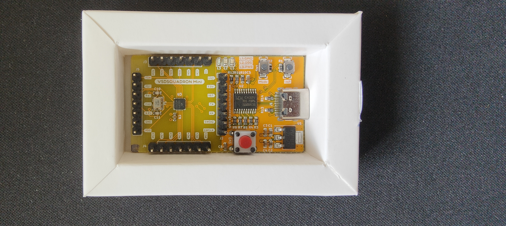
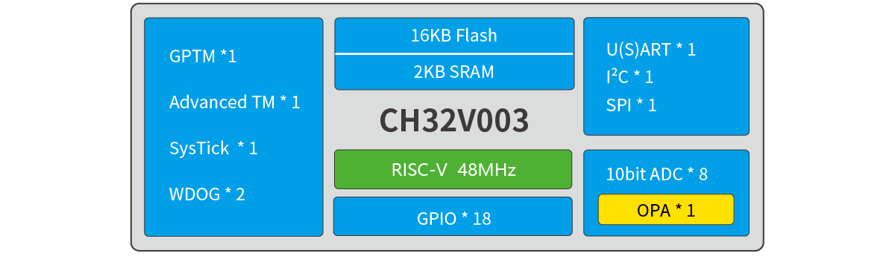

# vsdsquadron-mini-research
Building projects with the **VSDSquadron Mini** RISC-V board

[VSDSquadron Mini datasheet](./docs/VSDSQMinidatasheet.pdf)

[VSDSquadron Mini Schematic](./docs/SquadronMini_2A_Schematic.pdf.pdf)
## CH32V003 Chip datasheet

[CH32V003 datasheet](./docs/CH32V003DS0.PDF)
Features  |
---- |
| QingKe 32-bit RISC-V2A processor, supporting 2 levels of interrupt nesting  |
| Maximum 48MHz system main frequency |
| 2KB SRAM, 16KB Flash |
| Power supply voltage: 3.3/5V |
| Multiple low-power modes: Sleep, Standby |
| Power on/off reset, programmable voltage detector|
| 1 group of 1-channel general-purpose DMA controller|
| 1 group of op-amp comparator|
| 1 group of 10-bit ADC|
| 1×16-bit advanced-control timer, 1×16-bit general-purpose timer|
| 2 WDOG, 1×32-bit SysTick|
| 1 USART interface, 1 group of I2C interface, 1 group of SPI interface|
| 18 I/O ports, mapping an external interrupt|
| 64-bit chip unique ID|
| 1-wire serial debug interface (SDI)|

## CH32V003 Chip Reference Manual
[CH32V003 Reference Manua](./docs/CH32V003RM.PDF)

***
# Application Development
Building a realtime LED clock using I2C
Application steps |
--- |
I2C POC |
Driving a I2C LED module |
Connecting a I2C realtime clock |
Time setting control |

