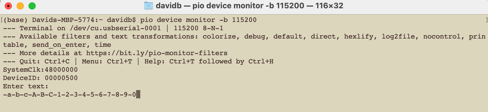

PlatformIO Uart_Echo project
=====================================
This is a serial charater echo project to test bidirectional UART communication for the VSDsquadron Mini device. Typing a character at the keyboard will echo the character back on the serial porti prefixed with a "-" character. The project is based on the PlatformIO framework.

To build and upload the firmware, you need to install the PlatformIO Core. The following commands will help you to install the PlatformIO Core and build the firmware.
1. [Install PlatformIO Core](https://docs.platformio.org/page/core.html)
2. Run these commands:

```shell
# Build project
$ pio run

# Upload firmware
$ pio run --target upload

# Clean build files
$ pio run --target clean
```
## API Reference
Github Framework [WCH-NoneOS-SDK](https://github.com/Community-PIO-CH32V/framework-wch-noneos-sdk/tree/5992d6957398992f7455e614c4988458f1aa970a)
| Function | Description |
|----------|-------------|
| [USART_Printf_Init](https://github.com/Community-PIO-CH32V/framework-wch-noneos-sdk/blob/5992d6957398992f7455e614c4988458f1aa970a/Debug/ch32v00x/debug.c) | Initializes the USARTx peripheral |
| [Delay_Ms](https://github.com/Community-PIO-CH32V/framework-wch-noneos-sdk/blob/5992d6957398992f7455e614c4988458f1aa970a/Debug/ch32v00x/debug.c) | Millisecond Delay Time |
| [USART_SendData](https://github.com/Community-PIO-CH32V/framework-wch-noneos-sdk/blob/main/Peripheral/ch32v00x/src/ch32v00x_usart.c) | Transmits single data through the USARTx peripheral |
| [USART_ReceiveData](https://github.com/Community-PIO-CH32V/framework-wch-noneos-sdk/blob/main/Peripheral/ch32v00x/src/ch32v00x_usart.c) | Returns the most recent received data by the USARTx peripheral |
| [USART_GetFlagStatus](https://github.com/Community-PIO-CH32V/framework-wch-noneos-sdk/blob/main/Peripheral/ch32v00x/src/ch32v00x_usart.c) | Checks whether the specified USART flag is set or not |

## Hardware Connection
The UART communication is done through the GPIO pins. The following table shows the connection between the VSDsquadron Mini and the USB to UART TTL converter. The USB to UART TTL converter I'm using is a CP2102 module.

| VSDsquadron Mini | USB to UART converter |
|------------------|-----------------------|
| TX (PD5)               | RX                    |
| RX (PD6)              | TX                    |
| GND              | GND                   |
| 3.3V             | 3.3V                  |

*Caution*: The VSDsquadron Mini is a +3.3V device. The USB to UART converter is powering all devices, so make sure to use the 3.3V from the USB to UART converter and not +5v. When programmiing the VSDsquadron Mini via the usb c, I still have the USB to UART converter wired up but not plugged into any USB socket.


## Serial Monitor
You can use any serial monitor to see the UART communication. The following command are what I use.

For MacOs, you will need to find the correct port, look for the device here /dev/tty.usb*:
```shell
ls /dev/tty.usb*   # Find the correct device
screen /dev/tty.usbserial-0001 115200 # Adjust for the serial device
```
Using PlatformIO (should work for all platforms):
```shell
pio device monitor -b 115200
```

