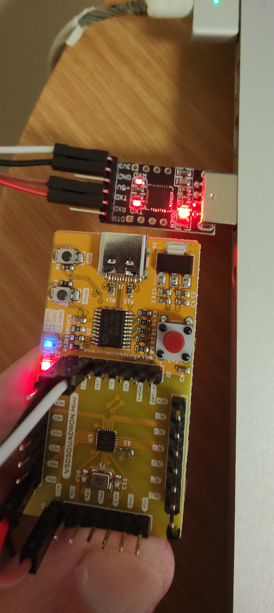
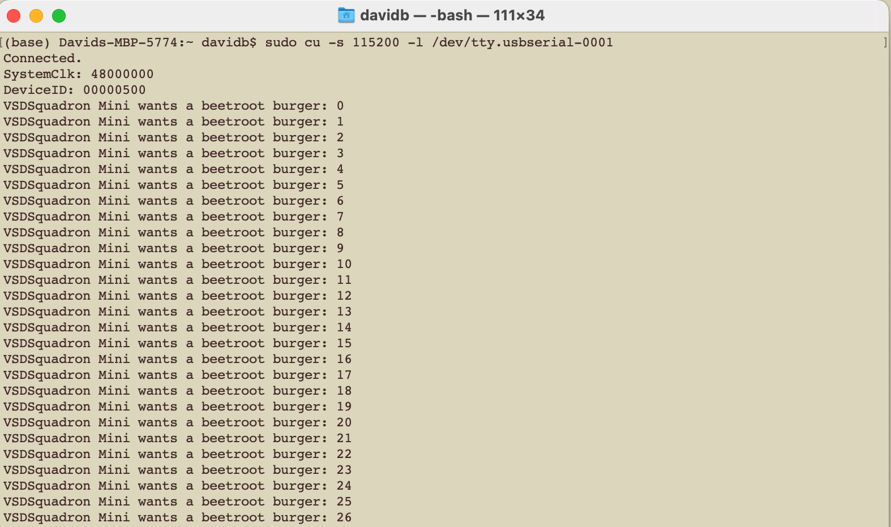

PlatformIO Uart_POC project
=====================================
This is a simple project to test the UART communication for the VSDsquadron Mini device. The project is based on the PlatformIO framework.

To build and upload the firmware, you need to install the PlatformIO Core. The following commands will help you to install the PlatformIO Core and build the firmware.
1. [Install PlatformIO Core](https://docs.platformio.org/page/core.html)
2. Run these commands:

```shell
# Build project
$ pio run

# Upload firmware
$ pio run --target upload

# Clean build files
$ pio run --target clean
```

## Hardware Connection
The UART communication is done through the GPIO pins. The following table shows the connection between the VSDsquadron Mini and the USB to UART converter.

| VSDsquadron Mini | USB to UART converter |
|------------------|-----------------------|
| TX (PD5)               | RX                    |
| RX (PD6)              | TX                    |
| GND              | GND                   |
| 3.3V             | 3.3V                  |



## Serial Monitor
You can use any serial monitor to see the UART communication. The following command will help you to open the serial monitor.

For Linux/MacOs, where you will need to find the correct /dev/tty.usb* device:
```shell
ls /dev/tty.usb*   # Find the correct device
sudo cu -s 115200 -l /dev/tty.usbserial-0001 # Adjust the serial device
```
Using PlatformIO:
```shell
pio device monitor -b 115200
```

